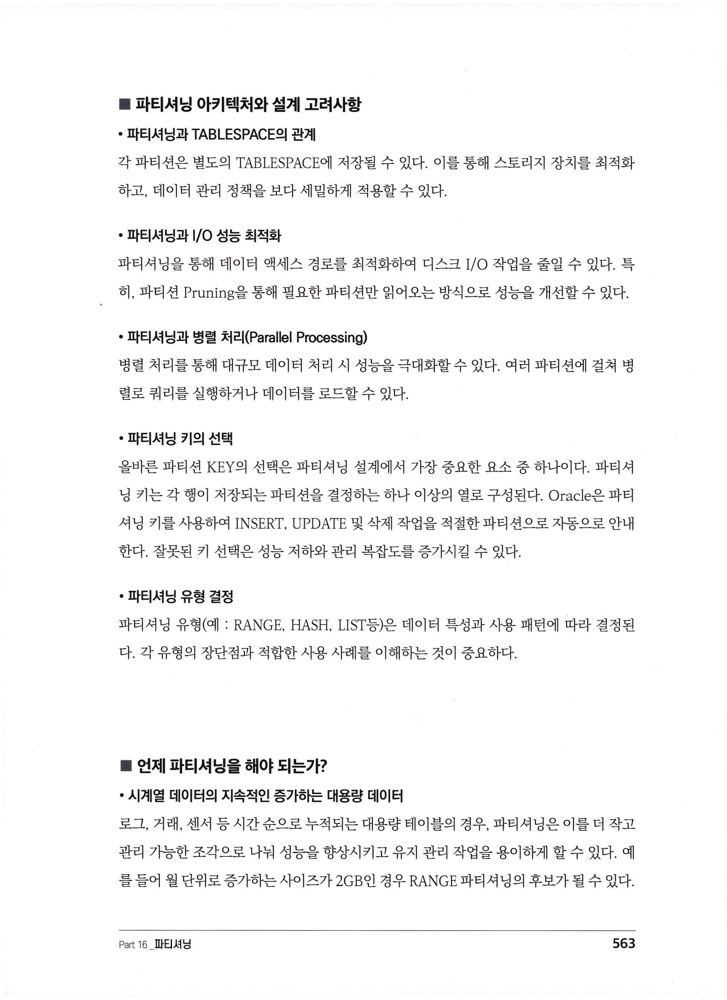
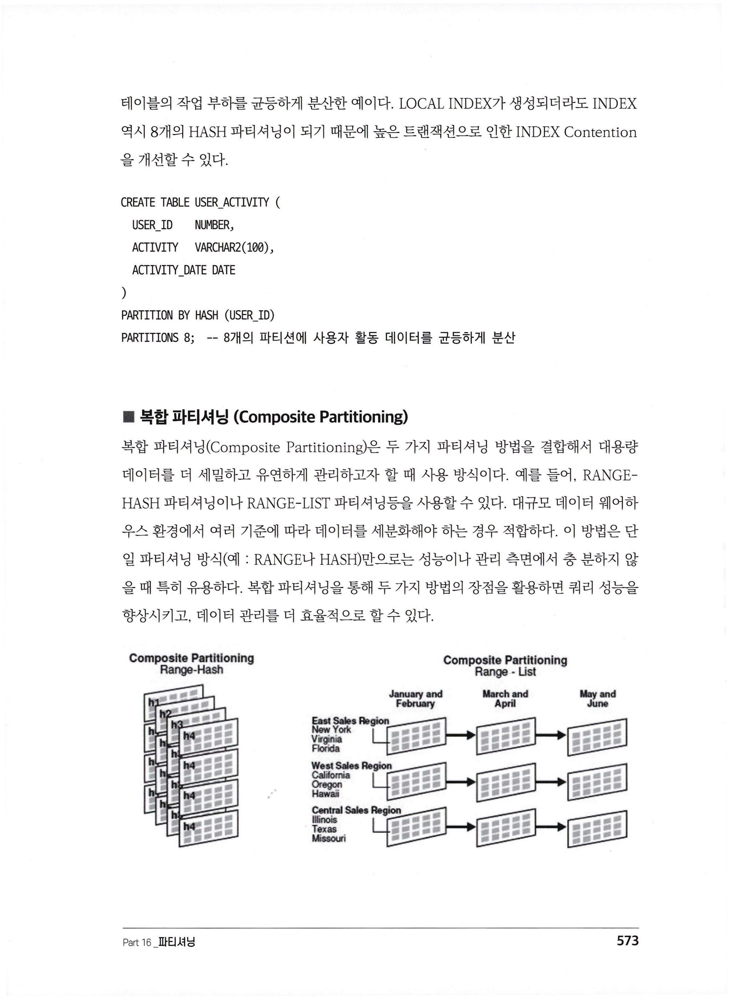
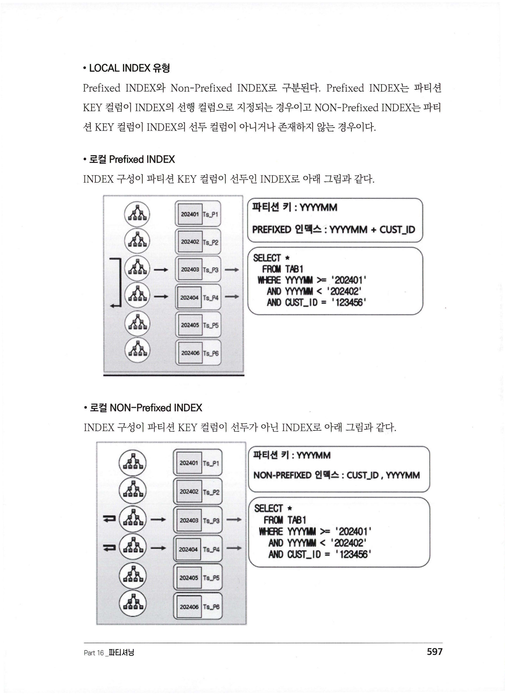
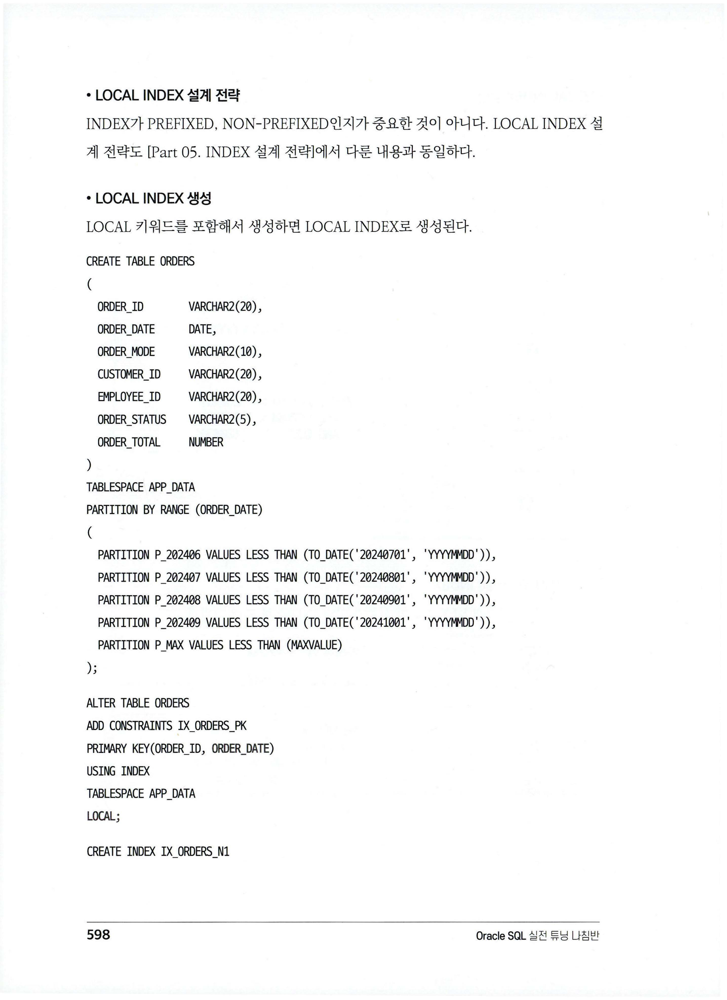
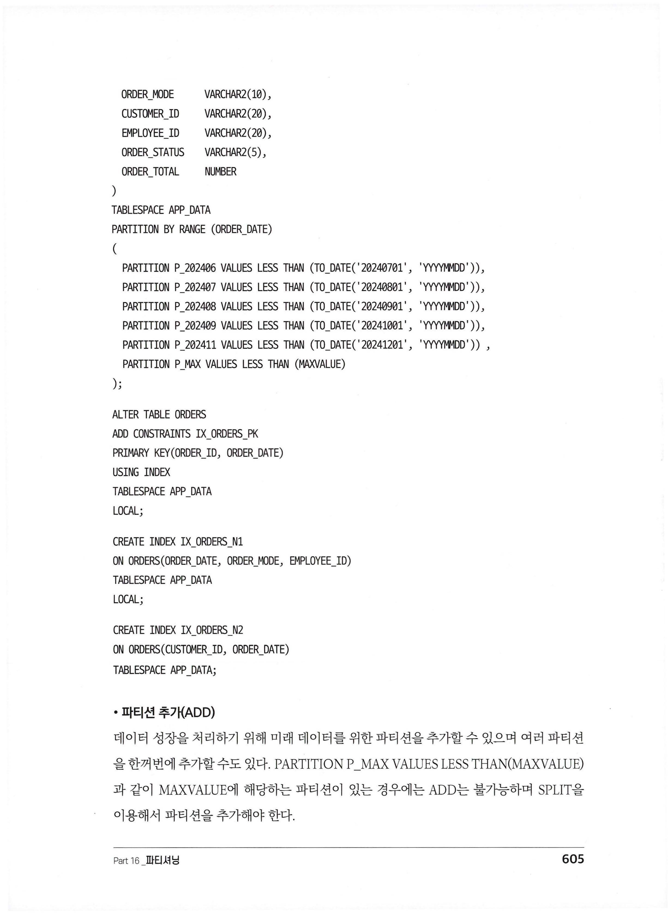

# Part 16. 파티셔닝 (Partitioning)

> 📖 출처: **Oracle SQL 실전 튜닝 나침반** — Part 16 파티셔닝 (pp.560~642)

---

## 목차

| Section | 제목 | 바로가기 |
|---------|------|---------|
| 01 | 개요 | [→](#section-01-개요) |
| 02 | 기본 개념 | [→](#section-02-기본-개념) |
| 03 | 파티셔닝 유형 | [→](#section-03-파티셔닝-유형) |
| 04 | 파티션 KEY 전략 | [→](#section-04-파티션-key-전략) |
| 05 | 파티셔닝 테이블의 INDEX | [→](#section-05-파티셔닝-테이블의-index) |
| 06 | 파티션 관리 | [→](#section-06-파티션-관리) |
| 07 | 파티션 Pruning | [→](#section-07-파티션-pruning) |

---

## Section 01. 개요

### 파티셔닝이란?

대규모 테이블이나 INDEX를 더 작은 조각(파티션)으로 나누어 관리하는 Database 기능이다.

### 파티셔닝의 4가지 장점

| 장점 | 설명 |
|------|------|
| **성능 향상** | 파티션 Pruning으로 필요한 파티션만 SCAN → 응답 시간 향상 |
| **관리 편의성** | 파티션 단위로 추가/삭제/백업 가능 → 유지보수 단순화 |
| **가용성** | 파티션별 독립 관리 → 유지보수 중에도 전체 테이블 가용 |
| **확장성** | 기존 파티션 영향 없이 새 파티션 추가 → 데이터 증가에 유연 |

### 한계와 고려 사항

- 모든 환경에서 최적의 솔루션이 아닐 수 있음
- **잘못된 파티셔닝 설계는 오히려 성능 저하** 초래 가능
- 적절한 파티션 KEY 선택과 유형 결정이 중요
- 성능 테스트와 모니터링을 통한 지속적인 최적화 필요

---

## Section 02. 기본 개념

### 기본 구성 요소

| 요소 | 설명 |
|------|------|
| **파티션 KEY** | 데이터가 어떤 파티션에 저장될지 결정하는 컬럼(또는 컬럼 조합) |
| **파티션 테이블** | 논리적으로 하나이지만 물리적으로 여러 파티션(세그먼트)으로 구성 |
| **LOCAL INDEX** | 파티션별로 생성되는 INDEX |
| **GLOBAL INDEX** | 전체 테이블 데이터를 대상으로 생성되는 INDEX |

### 설계 고려사항

- **TABLESPACE 분리**: 각 파티션을 별도 TABLESPACE에 저장 가능
- **I/O 최적화**: 파티션 Pruning으로 디스크 I/O 감소
- **병렬 처리**: 여러 파티션에 걸쳐 병렬 쿼리 실행 가능
- **파티션 KEY 선택이 가장 중요**: 잘못된 키 선택은 성능 저하와 관리 복잡도 증가

### 언제 파티셔닝을 해야 하는가?

- **시계열 대용량 데이터**: 월 단위 증가 사이즈가 2GB 이상인 경우 RANGE 파티셔닝 후보
- **트랜잭션 경합 분산**: 특정 Block 집중으로 경합 발생 시
- **데이터 관리 간소화**: 오래된 데이터 삭제를 파티션 DROP으로 대체
- **성능 최적화**: WHERE절에 파티션 KEY가 포함되는 쿼리가 많은 경우

---

## Section 03. 파티셔닝 유형

### 3가지 기본 파티셔닝 전략



---

### 1. RANGE 파티셔닝

특정 컬럼의 값이 **미리 정의된 범위**에 따라 데이터를 분할한다.

**적합한 경우**: 시간 기반 데이터, 순차적 데이터, 데이터 웨어하우스, 롤링 윈도우 작업

```sql
CREATE TABLE SALES
(
  SALE_ID    NUMBER,
  SALE_DATE  DATE,
  AMOUNT     NUMBER
)
PARTITION BY RANGE (SALE_DATE)
(
  PARTITION P_2022 VALUES LESS THAN (TO_DATE('20230101', 'YYYYMMDD')),
  PARTITION P_2023 VALUES LESS THAN (TO_DATE('20240101', 'YYYYMMDD')),
  PARTITION P_2024 VALUES LESS THAN (TO_DATE('20250101', 'YYYYMMDD'))
);
```

**주요 장점**:
- 파티션 Pruning으로 특정 범위 쿼리 성능 향상
- 오래된 파티션 삭제로 데이터 관리 간소화
- 날짜/숫자 범위 필터링 쿼리에 최적

---

### 2. LIST 파티셔닝

데이터가 **특정 고유 값**에 따라 논리적으로 나뉠 때 사용한다.

**적합한 경우**: 지역, 부서, 제품 카테고리, 상태 등 범주형 데이터

```sql
CREATE TABLE CUSTOMERS (
  CUSTOMER_ID   NUMBER,
  CUSTOMER_NAME VARCHAR2(50),
  REGION        VARCHAR2(20)
)
PARTITION BY LIST (REGION) (
  PARTITION P_NORTH VALUES ('NORTH'),
  PARTITION P_SOUTH VALUES ('SOUTH'),
  PARTITION P_EAST  VALUES ('EAST'),
  PARTITION P_WEST  VALUES ('WEST')
);
```

```sql
-- DEFAULT 파티션으로 예상치 못한 값 처리
CREATE TABLE PRODUCTS (
  PRODUCT_ID       NUMBER,
  PRODUCT_NAME     VARCHAR2(100),
  PRODUCT_CATEGORY VARCHAR2(50),
  PRICE            NUMBER
)
PARTITION BY LIST (PRODUCT_CATEGORY) (
  PARTITION ELECTRONICS VALUES ('ELECTRONICS'),
  PARTITION FURNITURE  VALUES ('FURNITURE'),
  PARTITION CLOTHING   VALUES ('CLOTHING'),
  PARTITION OTHER      VALUES (DEFAULT)
);
```

---

### 3. HASH 파티셔닝

HASH 함수를 적용하여 데이터를 **균등하게 분배**한다.

**적합한 경우**: 핫 스팟 방지, 트랜잭션 경합 분산, 병렬 쿼리 처리, Exadata Smart Scan 부하 분산

```sql
CREATE TABLE CUSTOMERS (
  CUSTOMER_ID   NUMBER,
  CUSTOMER_NAME VARCHAR2(50)
)
PARTITION BY HASH (CUSTOMER_ID)
PARTITIONS 4;
```

```sql
-- INDEX Contention 개선: LOCAL INDEX도 8개 HASH 파티셔닝됨
CREATE TABLE USER_ACTIVITY (
  USER_ID       NUMBER,
  ACTIVITY      VARCHAR2(100),
  ACTIVITY_DATE DATE
)
PARTITION BY HASH (USER_ID)
PARTITIONS 8;
```

---

### 복합 파티셔닝 (Composite Partitioning)

두 가지 파티셔닝 방법을 결합하여 더 세밀하게 데이터를 관리한다.



#### RANGE-HASH (가장 많이 사용)

```sql
CREATE TABLE SALES
(
  SALE_ID     NUMBER,
  SALE_DATE   DATE,
  CUSTOMER_ID NUMBER,
  AMOUNT      NUMBER
)
PARTITION BY RANGE (SALE_DATE)
SUBPARTITION BY HASH (CUSTOMER_ID)
SUBPARTITIONS 4
(
  PARTITION P_2022 VALUES LESS THAN (TO_DATE('20230101', 'YYYYMMDD')),
  PARTITION P_2023 VALUES LESS THAN (TO_DATE('20240101', 'YYYYMMDD')),
  PARTITION P_2024 VALUES LESS THAN (TO_DATE('20250101', 'YYYYMMDD'))
);
-- 총: 3 파티션 × 4 서브파티션 = 12개 세그먼트
```

#### RANGE-LIST (많이 사용)

```sql
CREATE TABLE SALES (
  SALE_ID   NUMBER,
  SALE_DATE DATE,
  REGION    VARCHAR2(20),
  AMOUNT    NUMBER
)
PARTITION BY RANGE (SALE_DATE)
SUBPARTITION BY LIST (REGION)
(
  PARTITION P_2023 VALUES LESS THAN (TO_DATE('20240101', 'YYYYMMDD'))
  (
    SUBPARTITION P_2023_NORTH VALUES ('NORTH'),
    SUBPARTITION P_2023_SOUTH VALUES ('SOUTH')
  ),
  PARTITION P_2024 VALUES LESS THAN (TO_DATE('20250101', 'YYYYMMDD'))
  (
    SUBPARTITION P_2024_NORTH VALUES ('NORTH'),
    SUBPARTITION P_2024_SOUTH VALUES ('SOUTH')
  )
);
```

#### RANGE-RANGE

```sql
CREATE TABLE ORDERS_PT (
  ORDER_ID      NUMBER,
  ORDER_DATE    DATE,
  DELIVERY_DATE DATE,
  CUSTOMER_ID   NUMBER,
  ORDER_AMOUNT  NUMBER
)
PARTITION BY RANGE (ORDER_DATE)
SUBPARTITION BY RANGE (DELIVERY_DATE)
(
  PARTITION P_ORD_202401 VALUES LESS THAN (TO_DATE('20240201', 'YYYYMMDD'))
  (
    SUBPARTITION P_OD_202401_202401 VALUES LESS THAN (TO_DATE('20240201', 'YYYYMMDD')),
    SUBPARTITION P_OD_202401_202402 VALUES LESS THAN (TO_DATE('20240301', 'YYYYMMDD'))
  ),
  PARTITION P_ORD_202402 VALUES LESS THAN (TO_DATE('20240301', 'YYYYMMDD'))
  (
    SUBPARTITION P_OD_202402_202401 VALUES LESS THAN (TO_DATE('20240201', 'YYYYMMDD')),
    SUBPARTITION P_OD_202402_202402 VALUES LESS THAN (TO_DATE('20240301', 'YYYYMMDD'))
  )
);
```

#### 기타 조합

LIST-HASH, LIST-RANGE, HASH-HASH, HASH-LIST, HASH-RANGE, LIST-LIST 모두 가능

---

### INTERVAL 파티셔닝

RANGE 파티셔닝의 확장형. 데이터 도착 시 **자동으로 새 파티션 생성**.

```sql
CREATE TABLE SALES_ORDERS (
  ORDER_ID    NUMBER,
  ORDER_DATE  DATE,
  CUSTOMER_ID NUMBER,
  ORDER_TOTAL NUMBER
)
PARTITION BY RANGE (ORDER_DATE)
INTERVAL (NUMTOYMINTERVAL(1, 'MONTH'))
(
  PARTITION P_202401 VALUES LESS THAN (TO_DATE('20240201', 'YYYYMMDD'))
);
-- 2024년 2월 데이터 INSERT 시 자동으로 파티션 생성!
```

---

### 가상 열 기반 파티셔닝 (Virtual Column)

물리적으로 저장하지 않는 **파생 컬럼**을 기준으로 파티셔닝.

```sql
CREATE TABLE SALES (
  SALE_ID    NUMBER,
  ORDER_DATE DATE,
  AMOUNT     NUMBER,
  ORDER_YEAR AS (EXTRACT(YEAR FROM ORDER_DATE))  -- 가상 열
)
PARTITION BY RANGE (ORDER_YEAR)
(
  PARTITION P2020 VALUES LESS THAN ('2021'),
  PARTITION P2021 VALUES LESS THAN ('2022'),
  PARTITION P2022 VALUES LESS THAN ('2023')
);
```

```sql
-- 할인 가격 기반 파티셔닝
CREATE TABLE ORDERS (
  ORDER_ID         NUMBER,
  TOTAL_PRICE      NUMBER,
  DISCOUNT         NUMBER,
  DISCOUNTED_PRICE AS (TOTAL_PRICE * (1 - DISCOUNT/100))  -- 가상 열
)
PARTITION BY RANGE (DISCOUNTED_PRICE)
(
  PARTITION P_LOW  VALUES LESS THAN (100),
  PARTITION P_MID  VALUES LESS THAN (500),
  PARTITION P_HIGH VALUES LESS THAN (1000)
);
```

**장점**: 중복 데이터 방지, 유연한 분할 로직, 스키마 복잡성 감소

---

## Section 04. 파티션 KEY 전략

### 핵심 원칙

> 파티션 KEY를 데이터 액세스 패턴과 맞추면 쿼리 성능이 크게 향상되고 리소스 소모가 줄어든다.

### 파티셔닝 유형별 KEY 선택 가이드

| 유형 | 적합한 KEY | 부적합한 KEY |
|------|-----------|-------------|
| **RANGE** | `SALE_DATE`, `ORDER_DATE`, `AMOUNT` 등 연속적 값 | 카테고리 값 |
| **LIST** | `REGION`, `CATEGORY`, `STATUS` 등 고유 유한 값 | 연속적 값 |
| **HASH** | `CUSTOMER_ID`, `ORDER_ID` 등 고유 값이 많은 컬럼 | `GENDER`, `STATUS` 등 고유 값이 적은 컬럼 |

### ⚠️ 파티션 개수 주의

> 일별 데이터 100MB, 일 단위 파티션, 보관 주기 2년이면 파티션 **730개**.
> 파티션 KEY가 없는 INDEX 조회 시 730개 파티션을 각각 ACCESS하는 **오버헤드 발생**.

---

## Section 05. 파티셔닝 테이블의 INDEX

### GLOBAL INDEX vs LOCAL INDEX



| 구분 | LOCAL INDEX | GLOBAL INDEX |
|------|------------|--------------|
| **파티션 구조** | 테이블 파티션과 1:1 대응 | 전체 데이터 대상 (하나의 INDEX) |
| **파티션 관리** | 자동 (추가/삭제 시 연동) | 수동 관리 필요 |
| **재구성 범위** | 특정 파티션만 REBUILD | 전체 INDEX REBUILD |
| **DDL 영향** | 해당 파티션 INDEX만 영향 | 전체 INDEX Unusable 가능 |
| **생성 방법** | `LOCAL` 키워드 포함 | `LOCAL` 키워드 생략 |

### LOCAL INDEX 유형



| 유형 | 설명 | 예시 (파티션 KEY: ORDER_DATE) |
|------|------|------|
| **Prefixed** | 파티션 KEY가 INDEX **선두 컬럼** | `(ORDER_DATE, ORDER_MODE, EMPLOYEE_ID)` |
| **Non-Prefixed** | 파티션 KEY가 선두가 **아님** | `(CUSTOMER_ID, ORDER_DATE)` 또는 `(CUSTOMER_ID)` |

### LOCAL INDEX 생성 예제

```sql
-- 테이블 생성
CREATE TABLE ORDERS (
  ORDER_ID     VARCHAR2(20),
  ORDER_DATE   DATE,
  ORDER_MODE   VARCHAR2(10),
  CUSTOMER_ID  VARCHAR2(20),
  EMPLOYEE_ID  VARCHAR2(20),
  ORDER_STATUS VARCHAR2(5),
  ORDER_TOTAL  NUMBER
)
TABLESPACE APP_DATA
PARTITION BY RANGE (ORDER_DATE)
(
  PARTITION P_202406 VALUES LESS THAN (TO_DATE('20240701', 'YYYYMMDD')),
  PARTITION P_202407 VALUES LESS THAN (TO_DATE('20240801', 'YYYYMMDD')),
  PARTITION P_202408 VALUES LESS THAN (TO_DATE('20240901', 'YYYYMMDD')),
  PARTITION P_202409 VALUES LESS THAN (TO_DATE('20241001', 'YYYYMMDD')),
  PARTITION P_MAX    VALUES LESS THAN (MAXVALUE)
);
```

```sql
-- PK (LOCAL INDEX) — 반드시 파티션 KEY 포함!
ALTER TABLE ORDERS
ADD CONSTRAINTS IX_ORDERS_PK
PRIMARY KEY(ORDER_ID, ORDER_DATE)
USING INDEX TABLESPACE APP_DATA LOCAL;
```

```sql
-- LOCAL Prefixed INDEX
CREATE INDEX IX_ORDERS_N1
ON ORDERS(ORDER_DATE, ORDER_MODE, EMPLOYEE_ID)
TABLESPACE APP_DATA LOCAL;
```

```sql
-- LOCAL Non-Prefixed INDEX
CREATE INDEX IX_ORDERS_N2
ON ORDERS(CUSTOMER_ID, ORDER_DATE)
TABLESPACE APP_DATA LOCAL;
```

### Non-Prefixed INDEX 성능 비교

| 조회 범위 | IX_N2 (CUSTOMER_ID, ORDER_DATE) | IX_N3 (CUSTOMER_ID) |
|-----------|------|------|
| **월 전체** | Buffers=20 | Buffers=20 (동일) |
| **7일** | **Buffers=5** ✅ | Buffers=20 (비효율) |

> 조회 범위가 좁아질수록 **파티션 KEY를 포함한 INDEX**가 유리하다.

### GLOBAL INDEX

```sql
-- LOCAL 키워드를 생략하면 GLOBAL INDEX
CREATE INDEX IX_ORDERS_N2
ON ORDERS(CUSTOMER_ID)
TABLESPACE APP_DATA;
```

**GLOBAL INDEX 사용 시 고려사항**:
- 파티션 DROP/TRUNCATE 시 **INDEX가 Unusable** → 장애 위험
- `SKIP_UNUSABLE_INDEXES = TRUE` 설정으로 DML 실패 방지 가능
- 대용량 Hot 테이블에서는 **사용 주의**

### DDL 작업별 INDEX Unusable 관계



| DDL 작업 | LOCAL INDEX | GLOBAL INDEX |
|----------|-------------|--------------|
| **ADD** | 새로 생성 → 무관 | 무관 |
| **DROP** | 같이 삭제 → 무관 | ⚠️ Unusable |
| **TRUNCATE** | 데이터 없음 → 무관 | ⚠️ Unusable |
| **SPLIT** | 해당 파티션 Unusable | ⚠️ Unusable |
| **MERGE** | 합쳐진 파티션 Unusable | ⚠️ Unusable |
| **MOVE** | 해당 파티션 Unusable | ⚠️ Unusable |
| **EXCHANGE** | 해당 파티션 Unusable | ⚠️ Unusable |
| **RENAME** | 무관 | 무관 |

---

## Section 06. 파티션 관리

### RANGE 파티션 관리

#### 파티션 추가 (ADD)

```sql
-- 단일 추가
ALTER TABLE ORDERS
ADD PARTITION P_202412 VALUES LESS THAN (TO_DATE('20250101', 'YYYYMMDD'));

-- 복수 추가
ALTER TABLE ORDERS
ADD PARTITION P_202412 VALUES LESS THAN (TO_DATE('20250101', 'YYYYMMDD')),
    PARTITION P_202501 VALUES LESS THAN (TO_DATE('20250201', 'YYYYMMDD')),
    PARTITION P_202502 VALUES LESS THAN (TO_DATE('20250301', 'YYYYMMDD'));
```

> ⚠️ **MAXVALUE 파티션이 존재하면 ADD 불가** → SPLIT 사용!

#### 파티션 삭제 (DROP)

```sql
ALTER TABLE ORDERS DROP PARTITION P_202406;

-- 복수 삭제
ALTER TABLE ORDERS DROP PARTITION P_202406, P_202407;

-- GLOBAL INDEX 유지하면서 삭제
ALTER TABLE ORDERS DROP PARTITION P_202406 UPDATE GLOBAL INDEXES;
```

#### 파티션 비우기 (TRUNCATE)

```sql
ALTER TABLE ORDERS TRUNCATE PARTITION P_202407;

-- GLOBAL INDEX 유지
ALTER TABLE ORDERS TRUNCATE PARTITION P_202407 UPDATE GLOBAL INDEXES;
```

> Redo/Undo 최소화 → DELETE보다 훨씬 빠름

#### 파티션 이동 (MOVE)

```sql
ALTER TABLE ORDERS
MOVE PARTITION P_202401 TABLESPACE APP_DATA PARALLEL 2 ONLINE COMPRESS NOLOGGING;

-- MOVE 후 반드시 LOCAL INDEX REBUILD!
ALTER INDEX IX_ORDERS_PK REBUILD PARTITION P_202410
TABLESPACE APP_DATA PARALLEL 2 NOLOGGING ONLINE;

ALTER INDEX IX_ORDERS_N1 REBUILD PARTITION P_202410
TABLESPACE APP_DATA PARALLEL 2 NOLOGGING ONLINE;
```

#### 파티션 교환 (EXCHANGE) — 가용성 우수 ✅

MOVE보다 **가용성이 월등히 좋음** (눈 깜짝할 사이에 EXCHANGE)

```sql
-- Step 1: 임시 테이블 생성 (압축, NOLOGGING)
CREATE TABLE TEMP_ORDERS_P_202408
TABLESPACE APP_DATA NOLOGGING COMPRESS
AS SELECT * FROM ORDERS PARTITION(P_202408);

ALTER TABLE TEMP_ORDERS_P_202408 LOGGING;

-- Step 2: 동일 구조 INDEX 생성
ALTER TABLE TEMP_ORDERS_P_202408
ADD CONSTRAINTS IX_TEMP_ORDERS_P_202408_PK
PRIMARY KEY(ORDER_ID, ORDER_DATE)
USING INDEX TABLESPACE APP_DATA NOLOGGING;

CREATE INDEX IX_TEMP_ORDERS_P_202408_N1
ON TEMP_ORDERS_P_202408(ORDER_DATE, ORDER_MODE, EMPLOYEE_ID)
TABLESPACE APP_DATA NOLOGGING;

-- Step 3: EXCHANGE 실행!
ALTER TABLE ORDERS
EXCHANGE PARTITION P_202408 WITH TABLE TEMP_ORDERS_P_202408
INCLUDING INDEXES WITHOUT VALIDATION;
```

| EXCHANGE 옵션 | 설명 |
|---------------|------|
| `WITHOUT VALIDATION` | 유효성 체크 생략 (빠름) |
| `WITH VALIDATION` | 유효성 체크 (데이터 건수에 비례하여 느려짐) |
| `INCLUDING INDEXES` | INDEX 포함 EXCHANGE |

#### 파티션 분할 (SPLIT)

```sql
-- 기존 파티션을 날짜 기준으로 분할
ALTER TABLE ORDERS
SPLIT PARTITION P_202409 AT (TO_DATE('20240915', 'YYYYMMDD'))
INTO (PARTITION P_202409_H1, PARTITION P_202409_H2);

-- MAXVALUE 파티션 SPLIT으로 새 파티션 추가
ALTER TABLE ORDERS
SPLIT PARTITION P_MAX AT (TO_DATE('20250101', 'YYYYMMDD'))
INTO (PARTITION P_202412, PARTITION P_MAX);
```

#### 파티션 병합 (MERGE)

```sql
ALTER TABLE ORDERS
MERGE PARTITIONS P_ONLINE, P_OFFLINE INTO PARTITION P_DIGITAL;
```

---

### LIST 파티션 관리

```sql
-- 추가 (DEFAULT 없을 때만 ADD 가능)
ALTER TABLE ORDERS ADD PARTITION P_PHONE VALUES ('PHONE');

-- DEFAULT 파티션 존재 시 → SPLIT 사용
ALTER TABLE ORDERS
SPLIT PARTITION P_DEFAULT VALUES ('APP')
INTO (PARTITION P_DEFAULT, PARTITION P_APP);
```

### 복합 파티션 서브파티션 관리

```sql
-- 서브파티션 추가
ALTER TABLE ORDERS
MODIFY PARTITION P_ONLINE
ADD SUBPARTITION P_ONLINE_SP_202406
VALUES LESS THAN (TO_DATE('20240701', 'YYYYMMDD'));

-- 서브파티션 MOVE
ALTER TABLE ORDERS
MOVE SUBPARTITION P_ONLINE_SP_202402
TABLESPACE APP_DATA PARALLEL 2 COMPRESS NOLOGGING;

-- 서브파티션 EXCHANGE
ALTER TABLE ORDERS
EXCHANGE SUBPARTITION P_ONLINE_SP_202402
WITH TABLE TEMP_ORDERS_P_ONLINE_SP_202402
INCLUDING INDEXES WITHOUT VALIDATION;

-- 서브파티션 SPLIT
ALTER TABLE ORDERS
SPLIT SUBPARTITION P_ONLINE_SP_MAX AT (TO_DATE('20240501', 'YYYYMMDD'))
INTO (SUBPARTITION P_ONLINE_SP_202405, SUBPARTITION P_ONLINE_SP_MAX);

-- 서브파티션 MERGE
ALTER TABLE ORDERS
MERGE SUBPARTITIONS P_ONLINE_SP_202401, P_ONLINE_SP_202402
INTO SUBPARTITION P_ONLINE_SP_202402;
```

### 관리 작업 비교 요약

| 작업 | 목적 | 가용성 영향 | INDEX REBUILD |
|------|------|-----------|---------------|
| **MOVE** | TABLESPACE 이동/재구성 | ❌ 작업 중 사용 불가 | ✅ 필요 |
| **EXCHANGE** | 비파티션 테이블과 교환 | ✅ **순간적** | ❌ 불필요 |
| **SPLIT** | 파티션 분할 | ⚠️ 물리적 분할 시 | ✅ 필요 |
| **MERGE** | 파티션 병합 | ⚠️ 물리적 병합 시 | ✅ 필요 |

---

## Section 07. 파티션 Pruning

### 개념

쿼리 실행 시 **WHERE절의 파티션 KEY를 기준**으로 필요한 파티션만 검색하고 나머지는 건너뛰는 최적화 기법.

### RANGE 파티션 Access Pattern (4가지)

> 테스트 환경: 월 단위 RANGE 파티션, 파티션당 약 300만 건, 총 약 3,600만 건

#### 1. PARTITION RANGE SINGLE — 1개 파티션만 SCAN

```sql
SELECT CUSTOMER_ID, ORDER_MODE, COUNT(*) AS CNT
  FROM ORDERS
 WHERE ORDER_DATE >= TO_DATE('20240601', 'YYYYMMDD')
   AND ORDER_DATE <  TO_DATE('20240701', 'YYYYMMDD')
 GROUP BY CUSTOMER_ID, ORDER_MODE;
```

```
PARTITION RANGE SINGLE  →  Starts=1, Buffers=19,053
```

#### 2. PARTITION RANGE ITERATOR — 연속 복수 파티션 순회

```sql
SELECT CUSTOMER_ID, ORDER_MODE, COUNT(*) AS CNT
  FROM ORDERS
 WHERE ORDER_DATE >= TO_DATE('20240601', 'YYYYMMDD')
   AND ORDER_DATE <  TO_DATE('20240901', 'YYYYMMDD')
 GROUP BY CUSTOMER_ID, ORDER_MODE;
```

```
PARTITION RANGE ITERATOR  →  Starts=3, Buffers=58,425
```

#### 3. PARTITION RANGE INLIST — IN 조건 기반

```sql
SELECT CUSTOMER_ID, ORDER_MODE, COUNT(*) AS CNT
  FROM ORDERS A
 WHERE ORDER_DATE IN (TO_DATE('20240120 132339', 'YYYYMMDDHH24MISS'),
                      TO_DATE('20240120 232241', 'YYYYMMDDHH24MISS'))
 GROUP BY CUSTOMER_ID, ORDER_MODE;
```

```
PARTITION RANGE INLIST  →  Starts=1, Buffers=19,560
```

#### 4. PARTITION RANGE ALL — ⚠️ 전체 파티션 SCAN

```sql
-- 파티션 KEY 조건이 없거나 Pruning 불가 시
PARTITION RANGE ALL  →  Starts=13, Buffers=230,000
```

### 성능 비교 요약

| Access Pattern | 파티션 수 | Buffers | 비고 |
|----------------|----------|---------|------|
| **SINGLE** | 1개 | 19,053 | ✅ 가장 효율적 |
| **ITERATOR** | 3개 | 58,425 | 범위 비례 |
| **INLIST** | 1개 | 19,560 | IN 조건 |
| **ALL** | 13개 (전체) | 230,000 | ❌ 최악 |

> ⚠️ PARTITION RANGE ALL이 빈번하면 **파티션 KEY를 잘못 설정한 것은 아닌지 검토** 필요!

---

### PARTITION RANGE JOIN-FILTER

HASH JOIN 시 선행 테이블의 JOIN 조건에 해당하는 파티션만 SCAN하도록 최적화.

```sql
SELECT A.CUSTOMER_ID, A.ORDER_MODE, COUNT(*) AS CNT
  FROM ORDERS A, STD_DATE B
 WHERE A.ORDER_DATE = B.ORDER_DATE
   AND B.ID = 10
 GROUP BY A.CUSTOMER_ID, A.ORDER_MODE;
```

```
PARTITION RANGE JOIN-FILTER  →  1개 파티션만 SCAN (HASH JOIN 시에만 나타남)
```

---

### 복합 파티션 Access Pattern

| 실행 계획 | 설명 |
|-----------|------|
| `PARTITION RANGE SINGLE + PARTITION LIST ALL` | 1개월 파티션 + 전체 서브파티션 |
| `PARTITION RANGE ITERATOR + PARTITION LIST SINGLE` | 복수 월 + 특정 서브파티션 |
| `PARTITION RANGE ALL + PARTITION LIST INLIST` | 전체 월 + IN 조건 서브파티션 |
| `PARTITION RANGE JOIN-FILTER + PARTITION LIST SINGLE` | JOIN 필터 + 특정 서브파티션 |

---

### 파티션 테이블 JOIN 핵심 ⭐

#### NESTED LOOP JOIN — 파티션 KEY 없으면 성능 급격 악화

```sql
-- ❌ BAD: 파티션 KEY 없이 JOIN → 전체 파티션 SCAN
SELECT /*+ LEADING(A B) USE_NL(B) */
       A.ORDER_MODE, B.PRODUCT_ID, COUNT(*) AS CNT, SUM(QUANTITY) AS QUANTITY
  FROM ORDERS A, ORDER_ITEMS B
 WHERE A.ORDER_ID = B.ORDER_ID                      -- ORDER_ID만으로 JOIN
   AND A.ORDER_DATE >= TO_DATE('20240101', 'YYYYMMDD')
   AND A.ORDER_DATE <  TO_DATE('20240102', 'YYYYMMDD')
 GROUP BY A.ORDER_MODE, B.PRODUCT_ID;
-- PARTITION RANGE ALL → Starts=133K, Buffers=402K
```

```sql
-- ✅ GOOD: 파티션 KEY를 JOIN 조건에 추가
SELECT /*+ LEADING(A B) USE_NL(B) */
       A.ORDER_MODE, B.PRODUCT_ID, COUNT(*) AS CNT, SUM(QUANTITY) AS QUANTITY
  FROM ORDERS A, ORDER_ITEMS B
 WHERE A.ORDER_ID = B.ORDER_ID
   AND A.ORDER_DATE = B.ORDER_DATE                  -- 파티션 KEY 추가!
   AND A.ORDER_DATE >= TO_DATE('20240101', 'YYYYMMDD')
   AND A.ORDER_DATE <  TO_DATE('20240102', 'YYYYMMDD')
 GROUP BY A.ORDER_MODE, B.PRODUCT_ID;
-- PARTITION RANGE SINGLE → Buffers=5,240 (약 1/77로 감소!)
```

> **NL JOIN에서 파티션 KEY가 없으면**: 선행 데이터 건수 × 파티션 개수만큼 I/O 급증

#### 파티션 KEY가 다를 때 — 날짜 규칙성 활용

파티션 KEY(`END_DATE`)와 조회 조건(`ORDER_DATE`)이 다를 때, 날짜 간 규칙성 확인:

```sql
-- 규칙성 확인 (최대 -30일 ~ +30일 차이)
SELECT TRUNC(ORDER_DATE - END_DATE) AS DIFF_DAY, COUNT(*) AS CNT
  FROM ORDER_ITEMS
 GROUP BY TRUNC(ORDER_DATE - END_DATE)
 ORDER BY 1;
```

```sql
-- 규칙성을 활용한 파티션 KEY 범위 추가
SELECT /*+ LEADING(A B) USE_NL(B) */
       A.ORDER_MODE, B.PRODUCT_ID, COUNT(*) AS CNT, SUM(QUANTITY) AS QUANTITY
  FROM ORDERS A, ORDER_ITEMS B
 WHERE A.ORDER_ID = B.ORDER_ID
   AND A.ORDER_DATE = B.ORDER_DATE
   AND A.ORDER_DATE >= TO_DATE('20240101', 'YYYYMMDD')
   AND A.ORDER_DATE <  TO_DATE('20240102', 'YYYYMMDD')
   AND B.END_DATE >= TO_DATE('20240101', 'YYYYMMDD') - 31   -- 규칙성 활용!
   AND B.END_DATE <  TO_DATE('20240102', 'YYYYMMDD') + 31
 GROUP BY A.ORDER_MODE, B.PRODUCT_ID;
-- PARTITION RANGE ALL → PARTITION RANGE ITERATOR (Starts 138K → 16K)
```

#### HASH JOIN — 파티션 와이즈 JOIN

```sql
-- ❌ 파티션 KEY 조건 각각 → 각각 PARTITION RANGE ITERATOR
SELECT /*+ LEADING(A B) USE_HASH(B) */
       A.ORDER_MODE, B.PRODUCT_ID, COUNT(*), SUM(QUANTITY)
  FROM ORDERS A, ORDER_ITEMS B
 WHERE A.ORDER_ID = B.ORDER_ID
   AND A.ORDER_DATE >= TO_DATE('20240101', 'YYYYMMDD')
   AND A.ORDER_DATE <  TO_DATE('20240701', 'YYYYMMDD')
   AND B.ORDER_DATE >= TO_DATE('20240101', 'YYYYMMDD')  -- 각각 조건
   AND B.ORDER_DATE <  TO_DATE('20240701', 'YYYYMMDD')
 GROUP BY A.ORDER_MODE, B.PRODUCT_ID;
-- PGA 메모리: 64MB
```

```sql
-- ✅ 파티션 KEY를 JOIN 조건으로 → 파티션 와이즈 JOIN!
SELECT /*+ LEADING(A B) USE_HASH(B) */
       A.ORDER_MODE, B.PRODUCT_ID, COUNT(*), SUM(QUANTITY)
  FROM ORDERS A, ORDER_ITEMS B
 WHERE A.ORDER_ID = B.ORDER_ID
   AND A.ORDER_DATE = B.ORDER_DATE                      -- JOIN 조건으로!
   AND A.ORDER_DATE >= TO_DATE('20240101', 'YYYYMMDD')
   AND A.ORDER_DATE <  TO_DATE('20240701', 'YYYYMMDD')
 GROUP BY A.ORDER_MODE, B.PRODUCT_ID;
-- PGA 메모리: 12MB (1/5.2로 감소!)
-- 파티션 단위로 쪼개서 JOIN → 메모리 효율적
```

> 부모-자식 테이블이 **동일 파티션 KEY로 구성**되고 **동일 KEY로 JOIN**되면 → **파티션 와이즈 JOIN**으로 PGA 메모리와 I/O 모두 최적화!

---

## 핵심 체크리스트 ✅

1. **파티션 KEY** = 가장 자주 WHERE절에 사용되는 컬럼
2. **파티션 수** = 너무 적으면 세분화 부족, 너무 많으면 오버헤드
3. **LOCAL INDEX 우선** = GLOBAL INDEX는 DDL 시 Unusable 위험
4. **PK에 파티션 KEY 포함** = LOCAL INDEX 생성 필수 조건
5. **JOIN 시 파티션 KEY 추가** = NL JOIN에서 I/O 급증 방지
6. **EXCHANGE > MOVE** = 가용성이 중요하면 EXCHANGE 선택
7. **PARTITION RANGE ALL 빈번** = 파티션 KEY 재검토 필요
